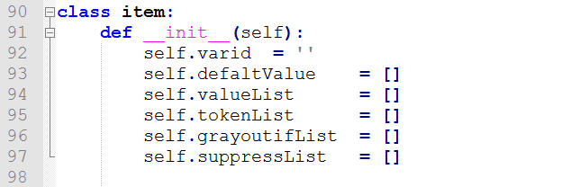
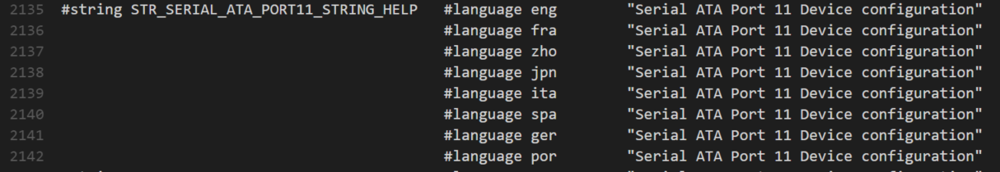
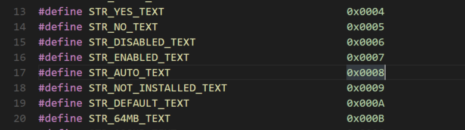
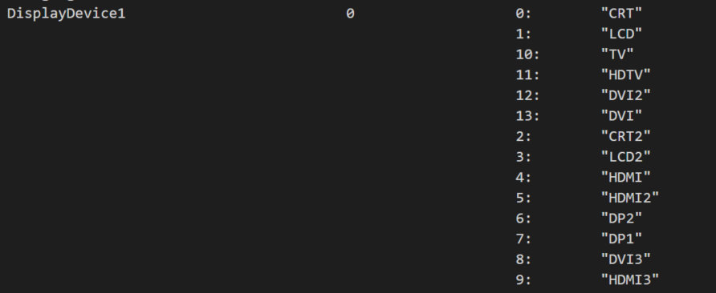

# Python简介

[TOC]


1 初识python
==========

Python是著名的“龟叔”Guido van Rossum在1989年圣诞节期间，为了打发无聊的圣诞节而编写的一个编程语言。
现在，全世界差不多有600多种编程语言，但流行的编程语言也就那么20来种。如果你听说过TIOBE排行榜，你就能知道编程语言的大致流行程度。[TIOBE 今年12月编程语言排行榜：](http://www.chengxuyuan.com/post/2245.html)


总的来说，这几种编程语言各有千秋。C语言是可以用来编写操作系统的贴近硬件的语言，所以，C语言适合开发那些追求运行速度、充分发挥硬件性能的程序。而Python是用来编写应用程序的高级编程语言。
当你用一种语言开始作真正的软件开发时，你除了编写代码外，还需要很多基本的已经写好的现成的东西，来帮助你加快开发进度。比如说，要编写一个电子邮件客户端，如果先从最底层开始编写网络协议相关的代码，那估计一年半载也开发不出来。高级编程语言通常都会提供一个比较完善的基础代码库，让你能直接调用，比如，针对电子邮件协议的SMTP库，针对桌面环境的GUI库，在这些已有的代码库的基础上开发，一个电子邮件客户端几天就能开发出来。
Python就为我们提供了非常完善的基础代码库，覆盖了网络、文件、GUI、数据库、文本等大量内容，被形象地称作“内置电池（batteries
included）”。用Python开发，许多功能不必从零编写，直接使用现成的即可。
除了内置的库外，Python还有大量的第三方库，也就是别人开发的，供你直接使用的东西。当然，如果你开发的代码通过很好的封装，也可以作为第三方库给别人使用。
许多大型网站就是用Python开发的，例如YouTube、[Instagram](http://instagram.com/)，还有国内的[豆瓣](http://www.douban.com/)。很多大公司，包括Google、Yahoo等，甚至[NASA](http://www.nasa.gov/)（美国航空航天局）都大量地使用Python。

龟叔给Python的定位是“优雅”、“明确”、“简单”，所以Python程序看上去总是简单易懂，初学者学Python，不但入门容易，而且将来深入下去，可以编写那些非常非常复杂的程序。

总的来说，Python的哲学就是简单优雅，尽量写容易看明白的代码，尽量写少的代码。如果一个资深程序员向你炫耀他写的晦涩难懂、动不动就几万行的代码，你可以尽情地嘲笑他。

那Python适合开发哪些类型的应用呢？

首选是网络应用，包括网站、后台服务等等；

其次是许多日常需要的小工具，包括系统管理员需要的脚本任务等等；

另外就是把其他语言开发的程序再包装起来，方便使用。

最后说说Python的缺点。

任何编程语言都有缺点，Python也不例外。优点说过了，那Python有哪些缺点呢？

第一个缺点就是运行速度慢，和C程序相比非常慢，因为Python是解释型语言，你的代码在执行时会一行一行地翻译成CPU能理解的机器码，这个翻译过程非常耗时，所以很慢。而C程序是运行前直接编译成CPU能执行的机器码，所以非常快。

但是大量的应用程序不需要这么快的运行速度，因为用户根本感觉不出来。例如开发一个下载MP3的网络应用程序，C程序的运行时间需要0.001秒，而Python程序的运行时间需要0.1秒，慢了100倍，但由于网络更慢，需要等待1秒，你想，用户能感觉到1.001秒和1.1秒的区别吗？这就好比F1赛车和普通的出租车在北京三环路上行驶的道理一样，虽然F1赛车理论时速高达400公里，但由于三环路堵车的时速只有20公里，因此，作为乘客，你感觉的时速永远是20公里。


## 1.1Python 和C语言的区别

C语言属于编译型语言，需要编译，链接等一系列操作才能执行结果。Python属于解释型语言，可以直接在命令行中执行。理论上，python的确比C/C++慢。这一点不用质疑。

C语言是面向过程的编程的方式。Python属于面向对象的编程方式。

Python 中没有指针。


#2 安装Python

得到所有Python相关软件最直接的方法就是去官方网站(<https://www.python.org/>)下载对应系统的版本。


##2.1 Python2 和python3 区别


Python官网提供两个版本可供下载，python3.5
和python2.7。这两个版本的程序是不向下兼容的。

为了不带入过多的累赘，Python 3.0在设计的时候没有考虑向下相容。

许多针对早期Python版本设计的程式都无法在Python 3.0上正常执行。

为了照顾现有程式，Python 2.6作为一个过渡版本，基本使用了Python
2.x的语法和库，同时考虑了向Python 3.0的迁移，允许使用部分Python
3.0的语法与函数。

新的Python程式建议使用Python 3.0版本的语法。

除非执行环境无法安装Python 3.0或者程式本身使用了不支援Python
3.0的第三方库。目前不支援Python 3.0的第三方库有Twisted, py2exe, PIL等。

大多数第三方库都正在努力地相容Python 3.0版本。即使无法立即使用Python
3.0，也建议编写相容Python 3.0版本的程式，然后使用Python 2.6, Python 2.7来执行。


##2.2 Python解释器

当我们编写Python代码时，我们得到的是一个包含Python代码的以.py为扩展名的文本文件。要运行代码，就需要Python解释器去执行.py文件。

由于整个Python语言从规范到解释器都是开源的，所以理论上，只要水平够高，任何人都可以编写Python解释器来执行Python代码（当然难度很大）。事实上，确实存在多种Python解释器。

**CPython**当我们从[Python官方网站](https://www.python.org/)下载并安装好Python
3.5后，我们就直接获得了一个官方版本的解释器：CPython。这个解释器是用C语言开发的，所以叫CPython。在命令行下运行python就是启动CPython解释器。

CPython是使用最广的Python解释器。教程的所有代码也都在CPython下执行。

**IPython**
IPython是基于CPython之上的一个交互式解释器，也就是说，IPython只是在交互方式上有所增强，但是执行Python代码的功能和CPython是完全一样的。好比很多国产浏览器虽然外观不同，但内核其实都是调用了IE。

CPython用\>\>\>作为提示符，而IPython用In [序号]:作为提示符。

**PyPy**
PyPy是另一个Python解释器，它的目标是执行速度。PyPy采用[JIT技术](http://en.wikipedia.org/wiki/Just-in-time_compilation)，对Python代码进行动态编译（注意不是解释），所以可以显著提高Python代码的执行速度。

绝大部分Python代码都可以在PyPy下运行，但是PyPy和CPython有一些是不同的，这就导致相同的Python代码在两种解释器下执行可能会有不同的结果。如果你的代码要放到PyPy下执行，就需要了解[PyPy和CPython的不同点](http://pypy.readthedocs.org/en/latest/cpython_differences.html)。

**Jython**
Jython是运行在Java平台上的Python解释器，可以直接把Python代码编译成Java字节码执行。

**IronPython**
IronPython和Jython类似，只不过IronPython是运行在微软.Net平台上的Python解释器，可以直接把Python代码编译成.Net的字节码。


##2.3 第一个python程序

对于大多数程序语言，第一个入门编程代码便是"Hello
World！"。打开python的IDE开发环境，输入以下代码。

```python
>>> print("hello world")
hello world
```

也可以在命令行下先输入python(进入python的环境)，然后再输入上面的命令，如下所示:
```python
C:\Users\finchyao.ZHAOXIN>python
Python 2.7.13 (v2.7.13:a06454b1afa1, Dec 17 2016, 20:53:40) [MSC v.1500 64 bit (AMD64)] on win32
Type "help", "copyright", "credits" or "license" for more information.
>>> print("hello world")
hello world
```

#3 Python基础


##3.1 Python 保留字

```python
>>> import keyword
>>> keyword.kwlist
['and', 'as', 'assert', 'break', 'class', 'continue', 'def', 'del', 'elif', 'else', 'except', 'exec', 'finally', 'for', 'from', 'global', 'if', 'import', 'in', 'is', 'lambda', 'not', 'or', 'pass', 'print', 'raise', 'return', 'try', 'while', 'with', 'yield']
```


##3.2 注释

确保对模块, 函数,方法和行内注释使用正确的风格，Python中的注释有单行注释和多行注释：

1、Python中单行注释以\#开头，例如：
```python
# 这是一个注释
print("Hello, World!")
```

2、多行注释用三个单引号（'''）或者三个双引号（"""）将注释括起来，例如:

单引号
```python
'''
这是多行注释，用三个单引号
这是多行注释，用三个单引号
这是多行注释，用三个单引号
'''
print("Hello, World!")

```

双引号
```python
"""
这是多行注释，用三个单引号
这是多行注释，用三个单引号
这是多行注释，用三个单引号
"""

```
##3.3 行与缩进


python最具特色的就是使用缩进来表示代码块，不需要使用大括号({})。
缩进的空格数是可变的，但是同一个代码块的语句必须包含相同的缩进空格数。实例如下：

```python
#Python
if True:
    print ("True")
else:
    print ("False")	
```
```C
//C
if(true){
    printf("True")
}
else{
    printf("False ")
}
```


如果缩进的空格不一致，会导致运行错误
```python
if True:
    print ("Answer")
    print ("True")
else:
    print ("Answer")
  print ("False")    # 缩进不一致，会导致运行错误
```

##3.4 基本数据类型

Python
中的变量不需要声明。每个变量在使用前都必须赋值，变量赋值以后该变量才会被创建。
在 Python中，变量就是变量，它没有类型，我们所说的"类型"是变量所指的内存中对象的类型。
等号（=）用来给变量赋值。
等号（=）运算符左边是一个变量名,等号（=）运算符右边是存储在变量中的值。例如：
```python
>>> counter = 100          # 整型变量
>>> miles   = 1000.0       # 浮点型变量
>>> name    = "runoob"     # 字符串
>>> print (counter)
100
>>> print (miles)
1000.0
>>> print (name)
runoob
```


**标准数据类型**

Python3 中有六个标准的数据类型：

-   Number（数字）

-   String（字符串）

-   List（列表）

-   Tuple（元组）

-   Sets（集合）

-   Dictionary（字典）

##3.5 运算符

### 3.5.1 算术运算符

以下假设变量a为10，变量b为21：

| 运算符  | 描述                        | 实例                              |
| ---- | ------------------------- | ------------------------------- |
| \+   | 加 - 两个对象相加                | a + b 输出结果 31                   |
| \-   | 减 - 得到负数或是一个数减去另一个数       | a - b 输出结果 -11                  |
| \*   | 乘 - 两个数相乘或是返回一个被重复若干次的字符串 | a \* b 输出结果 210                 |
| /    | 除 - x 除以 y                | b / a 输出结果 2.1                  |
| %    | 取模 - 返回除法的余数              | b % a 输出结果 1                    |
| \*\* | 幂 - 返回x的y次幂               | a\*\*b 为10的21次方                 |
| //   | 取整除 - 返回商的整数部分            | 9//2 输出结果 4 , 9.0//2.0 输出结果 4.0 |

<font style="color:red">Note: python中不包含++ 和—运算符。</font>

3.5.2 比较运算符

| 运算符  | 描述                                       | 实例                              |
| ---- | ---------------------------------------- | ------------------------------- |
| ==   | 等于 - 比较对象是否相等                            | (a == b) 返回 False。              |
| !=   | 不等于 - 比较两个对象是否不相等                        | (a != b) 返回 true.               |
| \<\> | 不等于 - 比较两个对象是否不相等                        | (a \<\> b) 返回 true。这个运算符类似 != 。 |
| \>   | 大于 - 返回x是否大于y                            | (a \> b) 返回 False。              |
| \<   | 小于 - 返回x是否小于y。所有比较运算符返回1表示真，返回0表示假。这分别与特殊的变量True和False等价。注意，这些变量名的大写。 | (a \< b) 返回 true。               |
| \>=  | 大于等于 - 返回x是否大于等于y。                       | (a \>= b) 返回 False。             |
| \<=  | 小于等于 - 返回x是否小于等于y。                       | (a \<= b) 返回 true。              |

### 3.5.2 赋值运算符

| 运算符   | 描述       | 实例                           |
| ----- | -------- | ---------------------------- |
| =     | 简单的赋值运算符 | c = a + b 将 a + b 的运算结果赋值为 c |
| \+=   | 加法赋值运算符  | c += a 等效于 c = c + a         |
| \-=   | 减法赋值运算符  | c -= a 等效于 c = c - a         |
| \*=   | 乘法赋值运算符  | c \*= a 等效于 c = c \* a       |
| /=    | 除法赋值运算符  | c /= a 等效于 c = c / a         |
| %=    | 取模赋值运算符  | c %= a 等效于 c = c % a         |
| \*\*= | 幂赋值运算符   | c \*\*= a 等效于 c = c \*\* a   |
| //=   | 取整除赋值运算符 | c //= a 等效于 c = c // a       |

### 3.5.3 逻辑运算符

Python语言支持逻辑运算符，以下假设变量 a 为 10, b为 20:

| 运算符  | 逻辑表达式   | 描述                                       |
| ---- | ------- | ---------------------------------------- |
| and  | x and y | 逻辑"与" - 如果 x 为 False，x and y 返回 False，否则它返回 y 的计算值。 |
| or   | x or y  | 逻辑"或" - 如果 x 是 True，它返回 True，否则它返回 y 的计算值。 |
| not  | not x   | 逻辑"非" - 如果 x 为 True，返回 False 。如果 x 为 False，它返回 True。 |

<font style="color:red">Note ：python中不包含(&&，\|\|，！)这三种运算符。</font>

##3.6 条件判断
  根据Python的缩进规则，如果if语句判断是True，就把缩进的两行print语句执行了，否则，什么也不做。也可以给if添加一个else语句，意思是，如果if判断是False，不要执行if的内容，去把else执行了：

```python
if <条件判断1>:
    <执行1>
elif <条件判断2>:
    <执行2>
elif <条件判断3>:
    <执行3>
else:
    <执行4>
```

<font style="color:red">Note: 注意冒号</font>


##3.7 循环 

Python的循环有两种，一种循环是while循环，只要条件满足，就不断循环，条件不满足时退出循环。比如我们要计算100以内所有奇数之和，可以用while循环实现：
```python
sum = 0
n = 99
while n > 0:
    sum = sum + n
    n = n - 2
print(sum)

```

另一种是for循环，for循环是通过迭代来实现的，依次把list中的每个元素迭代出来，看例子。
```python
#Python
table=[1, 2, 3, 4, 5, 6, 7, 8, 9, 10]
sum = 0
for x in table:
    sum = sum + x
print(sum)
```


#4常用的数据类型


python 中常用的数据结构有string(字符串)，list(列表)，dict(字典)，set


##4.1 字符串

字符串是 Python 中最常用的数据类型。

###4.1.1  定义字符串

字符串是 Python
中最常用的数据类型。我们可以使用引号('或")来创建字符串。创建字符串很简单，只要为变量分配一个值即可。例如：
```python
var0 = ''   #定义一个空字符串
var1 = 'Hello World!'
```


### 4.1.2Python 中的单引号和双引号

在[python](http://www.cnpythoner.com/)中字符串可以用单引号括起来，也可以用双引号，这两种方式是等价的，虽然表示的字符串，如果在python里，需要表示一个字符串对象的话，单引号和双引号没有区别。但是如果字符串中存在转义字符就会存在差别：比如分别使用两种方式来表达I
love ‘Python’:
```python
#单引号
>>> a = 'I love \'python\''
>>> print(a)
I love 'python'
```
```python
#双引号
>>> a = "I love 'python'"
>>> print(a)
I love 'python'
```

Print 结果是一样的，但是双引号中间是没有转义字符的。

### 4.1.3 Python 访问字符串中的值

Python 不支持单字符类型，单字符也在Python也是作为一个字符串使用。Python
访问子字符串，可以使用方括号来截取字符串，如下实例：
```python
>>> var1 = 'Hello World!'
>>> var2 = "Runoob"
>>> print ("var1[0]: ", var1[0])
var1[0]:  H
>>> print ("var2[1:5]: ", var2[1:5])
var2[1:5]:  unoo
```

### 4.1.4 Python字符串运算符

下表实例变量a值为字符串 "Hello"，b变量值为 "Python"：

| 操作符    | 描述                                       | 实例                                       |
| ------ | ---------------------------------------- | ---------------------------------------- |
| \+     | 字符串连接                                    | **\>\>\>** a**+**b 'HelloPython'         |
| \*     | 重复输出字符串                                  | **\>\>\>** a**\***2 'HelloHello'         |
| []     | 通过索引获取字符串中字符                             | **\>\>\>** a**[**1**]** 'e'              |
| [ : ]  | 截取字符串中的一部分                               | **\>\>\>** a**[**1**:**4**]** 'ell'      |
| in     | 成员运算符 - 如果字符串中包含给定的字符返回 True             | **\>\>\>** 'H' **in** a **True**         |
| not in | 成员运算符 - 如果字符串中不包含给定的字符返回 True            | **\>\>\>** 'M' **not in** a **True**     |
| r/R    | 原始字符串 - 原始字符串：所有的字符串都是直接按照字面的意思来使用，没有转义特殊或不能打印的字符。 原始字符串除在字符串的第一个引号前加上字母"r"（可以大小写）以外，与普通字符串有着几乎完全相同的语法。 | **>>> print(**r'I love \'python\'') I love \\'python\\'  		>>> print('I love \'python\'') I love 'python' |
| %      | 格式字符串                                    | 请看下一节内容。                                 |

### 4.1.5 格式化字符串

Python 支持格式化字符串的输出
。尽管这样可能会用到非常复杂的表达式，但最基本的用法是将一个值插入到一个有字符串格式符
%s 的字符串中。

在 Python 中，字符串格式化使用与 C 中 printf 函数一样的语法。

```python
>>> print ("我叫 %s 今年 %d 岁!" % ('小明', 10))
我叫 小明 今年 10 岁!
```


Python 字符串格式化符号

| 符号   | 描述                 |
| ---- | ------------------ |
| %c   | 格式化字符及其ASCII码      |
| %s   | 格式化字符串             |
| %d   | 格式化整数              |
| %u   | 格式化无符号整型           |
| %o   | 格式化无符号八进制数         |
| %x   | 格式化无符号十六进制数        |
| %X   | 格式化无符号十六进制数（大写）    |
| %f   | 格式化浮点数字，可指定小数点后的精度 |
| %e   | 用科学计数法格式化浮点数       |
| %E   | 作用同%e，用科学计数法格式化浮点数 |
| %g   | %f和%e的简写           |
| %G   | %f 和 %E 的简写        |
| %p   | 用十六进制数格式化变量的地址     |


##4.2 List


序列是Python中最基本的数据结构。序列中的每个元素都分配一个数字 -
它的位置，或索引，第一个索引是0，第二个索引是1，依此类推。

Python有6个序列的内置类型，但最常见的是列表和元组。

序列都可以进行的操作包括索引，切片，加，乘，检查成员。

此外，Python已经内置确定序列的长度以及确定最大和最小的元素的方法。

列表是最常用的Python数据类型，它可以作为一个方括号内的逗号分隔值出现。

列表的数据项不需要具有相同的类型

### 4.2.1 创建list

创建一个列表，只要把逗号分隔的不同的数据项使用方括号括起来即可。如下所示：

```python
List0 = [] #定义空的list
list1 = ['Google', 'Runoob', 1997, 2000]
list2 = [1, 2, 3, 4, 5 ]
list3 = ["a", "b", "c", "d"]
```


### 4.2.2 给list添加元素

可以使用append 给列表添加元素，可以添加一个元素，也可以添加一个’list’如下实例：

```python
list1 = ['Google', 'Runoob', 1997, 2000]
list2 = [1, 2, 3, 4, 5 ]
list3 = ["a", "b", "c", "d"]

list1.append("facebook")#添加一个元素
print(list1)
list2.append(list3)
print(list2)
```


以上实例输出结果如下所示：

```python
['Google', 'Runoob', 1997, 2000, 'facebook']
[1, 2, 3, 4, 5, ['a', 'b', 'c', 'd']]
```


### 4.2.3 访问list

使用下标索引来访问列表中的值，同样你也可以使用方括号的形式截取字符，如下所示：

```python
list1 = ['Google', 'Runoob', 1997, 2000];
list2 = [1, 2, 3, 4, 5, 6, 7 ];

print ("list1[0]: ", list1[0])
print ("list2[1:5]: ", list2[1:5])
```

以上实例输出结果如下所示：

```python
list1[0]:  Google
list2[1:5]:  [2, 3, 4, 5]
```


### 4.2.4 List 成员函数

| list.**append**(*x*)                     | Add an item to the end of the list. Equivalent to a[len(a):] = [x]. |
| ---------------------------------------- | ---------------------------------------- |
| list.**extend**(*L*)                     | Extend the list by appending all the items in the given list. Equivalent to a[len(a):] = L. |
| list.**insert**(*i*, *x*)                | Insert an item at a given position. The first argument is the index of the element before which to insert, so a.insert(0, x) inserts at the front of the list, and a.insert(len(a), x) is equivalent to a.append(x). |
| list.**remove**(*x*)                     | Remove the first item from the list whose value is *x*. It is an error if there is no such item. |
| list.**pop**([*i*])                      | Remove the item at the given position in the list, and return it. If no index is specified, a.pop() removes and returns the last item in the list. (The square brackets around the *i* in the method signature denote that the parameter is optional, not that you should type square brackets at that position. You will see this notation frequently in the Python Library Reference.) |
| list.**clear**()                         | Remove all items from the list. Equivalent to del a[:]. |
| list.**index**(*x*)                      | Return the index in the list of the first item whose value is *x*. It is an error if there is no such item. |
| list.**count**(*x*)                      | Return the number of times *x* appears in the list |
| list.**sort**(*key=None*, *reverse=False*) | Sort the items of the list in place (the arguments can be used for sort customization, see sorted() for their explanation). |
| list.**reverse**()                       | Reverse the elements of the list in place. |
| list.**copy**()                          | Return a shallow copy of the list. Equivalent to a[:]. |

例子

```python
>>> a=[66.24,333,333,1,1234.5]
>>> print(a.count(333),a.count(66.24),a.count('x'))
2 1 0
>>> a.insert(2,-1)
>>> a
[66.24, 333, -1, 333, 1, 1234.5]
>>> a.append(333)
>>> a
[66.24, 333, -1, 333, 1, 1234.5, 333]
>>> a.index(333)
1
>>> a.remove(333)
>>> a
[66.24, -1, 333, 1, 1234.5, 333]
>>> a.reverse()
>>> a
[333, 1234.5, 1, 333, -1, 66.24]
>>> a.sort()
>>> a
[-1, 1, 66.24, 333, 333, 1234.5]
>>> a.pop()
1234.5
>>> a
[-1, 1, 66.24, 333, 333]
```

Note：append 和extend 的区别

```python
>>> var1=[1,2,4]
>>> var2=['a','b','c']
>>> var3=['a','b','c']
>>> var2.append(var1)
>>> var2
['a', 'b', 'c', [1, 2, 4]]
>>> var3.extend(var1)
>>> var3
['a', 'b', 'c', 1, 2, 4]

```


### 4.2.5 使用list 实现stack

栈：(last-in, first-out)

```python
>>> stack = [3, 4, 5]
>>> stack.append(6)
>>> stack.append(7)
>>> stack
[3, 4, 5, 6, 7]
>>> stack.pop()
7
>>> stack
[3, 4, 5, 6]
>>> stack.pop()
6
>>> stack.pop()
5
>>> stack
[3, 4]
```


### 4.2.6 使用list 实现队列

队列(First-in, First-out)

```python
>>> queue = ["Eric", "John", "Michael"]
>>> queue.append("Terry") # Terry arrives
>>> queue.append("Graham") # Graham arrives
>>> queue.popleft() # The first to arrive now leaves
>>> queue.pop(0) # The first to arrive now leaves
'Eric'
>>> queue.pop(0) # The second to arrive now leaves
'John'
>>> queue
['Michael', 'Terry', 'Graham']

```

##4.3 dict


Python内置了字典：dict的支持，dict全称dictionary，在其他语言中也称为map，使用键-值（key-value）存储，具有极快的查找速度。dict的实现原理和查字典是一样的。假设字典包含了1万个汉字，我们要查某一个字，一个办法是把字典从第一页往后翻，直到找到我们想要的字为止，这种方法就是在list中查找元素的方法，list越大，查找越慢。第二种方法是先在字典的索引表里（比如部首表）查这个字对应的页码，然后直接翻到该页，找到这个字。无论找哪个字，这种查找速度都非常快，不会随着字典大小的增加而变慢。

### 4.3.1 创建dict

字典的每个键值(key=\>value)对用冒号(:)分割，每个对之间用逗号(,)分割，整个字典包括在花括号{}中
,格式如下所示：

```python
dict1   = {} #创建空的字典
dict2   = {'Alice': '2341', 'Beth': '9102', 'Cecil': '3258'}#键值和value值均为字符串
dict3   = { 'abc': 456 }#键值是字符串，value为数值
dict4   = { 'abc': 123, 98.6: 37 };#键值为字符串和数值混合
```


### 4.3.2 访问dict值

把相应的键放入熟悉的方括弧，如下实例:

```python
dict = {'Name': 'Runoob', 'Age': 7, 'Class': 'First'}

print ("dict['Name']: ", dict['Name'])
print ("dict['Age']: ", dict['Age'])
```

以上实例输出结果：

```python
dict['Name']:  Runoob
dict['Age']:  7
```


##4.4 Set


set和dict类似，也是一组key的集合，但不存储value。由于key不能重复，所以，在set中，没有重复的key。

要创建一个set，需要提供一个list作为输入集合：


#5 函数


函数是组织好的，可重复使用的，用来实现单一，或相关联功能的代码段。

函数能提高应用的模块性，和代码的重复利用率。你已经知道Python提供了许多内建函数，比如print()。但你也可以自己创建函数，这被叫做用户自定义函数。


##5.1 定义函数和调用

你可以定义一个由自己想要功能的函数，以下是简单的规则：

-   函数代码块以 def 关键词开头，后接函数标识符名称和圆括号 ()。

-   任何传入参数和自变量必须放在圆括号中间，圆括号之间可以用于定义参数。

-   函数的第一行语句可以选择性地使用文档字符串—用于存放函数说明。

-   函数内容以冒号起始，并且缩进。

-   return  [表达式]  结束函数，选择性地返回一个值给调用方。不带表达式的return相当于返回None。

语法

Python 定义函数使用 def 关键字，一般格式如下：

```python
def 函数名（参数列表）:
    函数体

实例
定义一个函数，函数输出“hello，world”
def hello() :
print("Hello World!")
hello()
```

以上输出结果

```python
def 函数名（参数列表）:
    函数体

实例
定义一个函数，函数输出“hello，world”
def hello() :
print("Hello World!")
hello()
```

更复杂点的应用，函数中带上参数变量:

```python
def area(width, height):
    return width * height
 
def print_welcome(name):
    print("Welcome", name)

print_welcome("Runoob")
w = 4
h = 5
print("width =", w, " height =", h, " area =", area(w, h))
```

以上实例输出结果：

```python
Welcome Runoob
width = 4  height = 5  area = 20
```


##5.2 函数的参数

在 Python中，所有参数（变量）都是按引用传递。如果你在函数里修改了参数，那么在调用这个函数的函数里，原始的参数也被改变了。例如：

```python
def changeme( mylist ):
   "修改传入的列表"
   mylist.append([1,2,3,4]);
   print ("函数内取值: ", mylist)
   return
 
# 调用changeme函数
mylist = [10,20,30];
changeme( mylist );
print ("函数外取值: ", mylist)

```


以上实例输出结果：

```python
函数内取值:  [10, 20, 30, [1, 2, 3, 4]]
函数外取值:  [10, 20, 30, [1, 2, 3, 4]]
```


##5.3 函数的返回值


return语句，return[表达式] 语句用于退出函数，选择性地向调用方返回一个表达式。不带参数值的return语句返回None。之前的例子都没有示范如何返回数值，以下实例演示了return 语句的用法：

```python
def sum( arg1, arg2 ):
   # 返回2个参数的和."
   total = arg1 + arg2
   print ("函数内 : ", total)
   return total;

# 调用sum函数
total = sum( 10, 20 );
print ("函数外 : ", total)
```


多个参数的返回及调用

```python
def fun(a,b):
    c = a + b
    return a,b,c

# 调用fun函数,并打印返回值
x,y,z = fun(1,2)
print("x=",x,"y=",y,"z=",z)

```

以上实例输出结果：

```python
x= 1 y= 2 z= 3
```


#6 模块

模块让你能够有逻辑地组织你的Python代码段。把相关的代码分配到一个模块里能让你的代码更好用，更易懂。模块也是Python对象，具有随机的名字属性用来绑定或引用。
简单地说，模块就是一个保存了Python代码的文件。模块能定义函数，类和变量。模块里也能包含可执行的代码。

##6.1 调用模块

Python提供了把一些定义存放在文件中，为一些脚本或者交互式的解释器实例使用，这个文件被称为模块。
模块是一个包含所有你定义的函数和变量的文件，其后缀名是.py。模块可以被别的程序引入，以使用该模块中的函数等功能。这也是使用python 标准库的方法。下面是一个使用 python 标准库中模块的例子。

```python
import math
print(math.sqrt(5))
```


1、import math 引入 python 标准库中的 math.py 模块；这是引入某一模块的方法。
2、math.sqrt(5) 计算根号5。

### 6.1.1 import 语句

想使用 Python 源文件，只需在另一个源文件里执行 import 语句，语法如下：

当解释器遇到 import 语句，如果模块在当前的搜索路径就会被导入。

搜索路径是一个解释器会先进行搜索的所有目录的列表。如想要导入模块
support，需要把命令放在脚本的顶端：

support.py 文件代码为：

```python
# Filename: support.py
def print_func( par ):
    print ("Hello : ", par)
    return
```

如果想在test.py 引入 support 模块：

```python
# Filename: test.py
# 导入模块
import support
# 现在可以调用模块里包含的函数了
support.print_func("Runoob")
```


### 6.1.2 from…import 语句

Python的from语句让你从模块中导入一个指定的部分到当前命名空间中，语法如下：

如果想在test.py 引入 pritnt\_func 函数也可以用下面来实现：

```python
# Filename: test.py
from support import print_func
# 现在可以直接调用print_func的函数了
print_func("Runoob")
```


### 6.1.3 From…import\* 语句

上面那种方式是只导入一个函数，也可以把一个模块的所有内容全都导入到当前的命名空间也是可行的，只需使用如下声明：

```python
from modname import *
```


这提供了一个简单的方法来导入一个模块中的所有项目。但是好多资料中都不建议这种调用。


#6.2 定义模块

Python
中一个文件即为一个模块，python中将某一些函数放在同一个.py文件中即定义了一个模块。

一个模块被另一个程序第一次引入时，其主程序将运行。如果我们想在模块被引入时，模块中的某一程序块不执行，我们可以用\_\_name\_\_属性来使该程序块仅在该模块自身运行时执行。

```python
if __name__=='__main__':
    test()
```


当我们在命令行运行hello模块文件时，Python解释器把一个特殊变量\_\_name\_\_置为\_\_main\_\_，而如果在其他地方导入该hello模块时，if判断将失败，因此，这种if测试可以让一个模块通过命令行运行时执行一些额外的代码，最常见的就是测试该模块。


##6.3 安装第三方模块
在Python中，安装第三方模块，是通过包管理工具pip完成的。
Windows的安装包在安装的时候，确保安装时勾选了pip和Add python.exe to Path。
在命令提示符窗口下尝试运行pip，如果Windows提示未找到命令，可以重新运行安装程序添加pip。
一般来说，第三方库都会在Python官方的[pypi.python.org](https://pypi.python.org/)网站注册，要安装一个第三方库，必须先知道该库的名称，可以在官网或者pypi上搜索，安装命令如下：
```shell
pip install module
```

耐心等待下载并安装后，就可以使用Pillow了。


#7 IO编程

读写文件是最常见的IO操作。Python内置了读写文件的函数，用法和C是兼容的。
读写文件前，我们先必须了解一下，在磁盘上读写文件的功能都是由操作系统提供的，现代操作系统不允许普通的程序直接操作磁盘，所以，读写文件就是请求操作系统打开一个文件对象（通常称为文件描述符），然后，通过操作系统提供的接口从这个文件对象中读取数据（读文件），或者把数据写入这个文件对象（写文件）。

#7.1 读文件

要以读文件的模式打开一个文件对象，使用Python内置的open()函数，传入文件名和标示符：
```python
f =open('test.txt','r')
```


标示符'r'表示读，这样，我们就成功地打开了一个文件。
如果文件不存在，open()函数就会抛出一个IOError的错误，并且给出错误码和详细的信息告诉你文件不存在：
如果文件打开成功，接下来，调用read()方法可以一次读取文件的全部内容，Python把内容读到内存，用一个str对象表示：

```python
>>>f.read()
'Hello World'
```

最后一步是调用close()方法关闭文件。文件使用完毕后必须关闭，因为文件对象会占用操作系统的资源，并且操作系统同一时间能打开的文件数量也是有限的：

```python
>>>f.read()
'Hello World'
```


由于文件读写时都有可能产生IOError，一旦出错，后面的f.close()就不会调用。所以，为了保证无论是否出错都能正确地关闭文件，我们可以使用try...  finally来实现：

```python
try:
    f = open('/path/to/file', 'r')
    print(f.read())
finally:
    if f:
        f.close()
```

但是每次都这么写实在太繁琐，所以，Python引入了with语句来自动帮我们调用close()方法：

```python
with open('test.txt','r')as f:
    f.write('Hello,world!')
```

##7.2 写文件


写文件和读文件是一样的，唯一区别是调用open()函数时，传入标识符'w'或者'wb'表示写文本文件或写二进制文件：

```python
f =open('test.txt','w')
f.write('hello world')
f.close()
```

你可以反复调用write()来写入文件，但是务必要调用f.close()来关闭文件。当我们写文件时，操作系统往往不会立刻把数据写入磁盘，而是放到内存缓存起来，空闲的时候再慢慢写入。只有调用close()方法时，操作系统才保证把没有写入的数据全部写入磁盘。忘记调用close()的后果是数据可能只写了一部分到磁盘，剩下的丢失了。所以，还是用with语句来得保险：

```python
with open('test.txt','w')as f:
    f.write('Hello,world!')
```


##7.3 格式美化输出


格式化一个字符串的输出结果，我们在很多地方都可以看到，如：c/c++中都有见过，python中的字符串格式函数str.format()可以灵活控制字符串输出占用宽度，从而使输出比较美化。

```python
>>> print('{0:10}{1:20}'.format('python','python'))
python    python
>>> print('{0:10}{1:20}{2:5}'.format('python','python','c++'))
python    python              c++
f.write('{0:10}{1:20}{2:5}'.format('python','python','c++'))
python    python              c++
```


##7.4 目录操作


如果我们要操作文件、目录，可以在命令行下面输入操作系统提供的各种命令来完成。比如dir、cd等命令。
如果要在Python程序中执行这些目录和文件的操作怎么办？其实操作系统提供的命令只是简单地调用了操作系统提供的接口函数，Python内置的os模块也可以直接调用操作系统提供的接口函数。os 模块提供了非常丰富的方法用来处理文件和目录。常用的方法如下表所示：

| 创建目录      | os.mkdir("file")                     |                       |
| --------- | ------------------------------------ | --------------------- |
| 复制文件      | shutil.copyfile("oldfile","newfile") | oldfile和newfile都只能是文件 |
| 切换路径      | os.chdir("path")                     | \#换路径                 |
| 重命名文件（目录） | os.rename("oldname","newname")       | \#文件或目录都是使用这条命令       |
| 删除文件      | os.remove("file")                    |                       |
| 删除目录      | shutil.rmtree("dir")                 | \#空目录、有内容的目录都可以删      |
| 移动文件（目录）  | shutil.move("oldpos","newpos")       |                       |


#8 错误和异常


#9 正则表达式

正则表达式是一个特殊的字符序列，它能帮助你方便的检查一个字符串是否与某种模式匹配。

Python 自1.5版本起增加了re 模块，它提供 Perl 风格的正则表达式模式。

re 模块使 Python 语言拥有全部的正则表达式功能。

```python
>>> import re
>>> pattern = re.compile('"(.*)"')
>>> a = r'string SCU_TITLE_STRING              #language eng        "Kunlun Setup Utility"'
>>> pattern.findall(a)
['Kunlun Setup Utility'
```


#10 提取.i文件信息


```python
filename    = 'AdvanceVfr.i'            #定义输入文件名
result      = []                        #定义一个空列表，作为输出结果
with open(filename,'r') as f:           #以只读的方式将文件读入
lines   = f.readlines()             
# 以行的方式读入，readlines 的返回值为一个列表，lines就为一个列表
    for line in lines:                  # 以迭代的方式遍历每一行
        if 'varid' in line:             #如果这行中含有varid 这个字符串
            result.append(line.strip()) #把这一行加入到最终的结果列表中

resultFilename  = 'debug.txt'       #输出文件名
with open(resultFilename,'w')as f:  #以写的方式打开文件
    for line in result:             #以迭代的方式读入列表的每一个元素
        f.write(list+'\n')          #将列表中所有的元素写入文件中
        print(line)                 #以print的方式输出

```

1.  首先是文件操作，首先以只读方式打开文件

2.  以迭代的方式将每一行的数据读入内存中

3.  根据one of信息剔除毫不相干的信息

4.  提取信息

5.  写入文件


#11 Setup tool 实现流程


整个脚本是使用python完成的，通过一步步实现功能来最终达到提取字符串并排序。主要分为以下几个步骤：

1.  根据.i 文件提取信息

>   下图是要提取的主要部分

>   [./python_learning/image3.png](./python_learning/image3.png)

提取.i文件中的varid值以及所对应的value 和default
value值string\_token值，并将其放入一个class中（相当于一个结构体），最后将一个‘.i’文件中的所有varid、defalt
value、所有的value值以及value所对应的token值提取出来，并放入一个list中（这里相当于结构体数组）；class
定义如下：



1.  解析数据并找到对应的字符串。

STRING\_TOKEN的对应关系如下：

首先是.UNI文件中为每一个字符串建立了一个宏，然后又为每一个宏分配了一个唯一的ID，如下图所示



图 字符串与宏的对应关系



图 宏与ID之间的关系

（1）分别建立字符串与宏的关系dict1:string : macro。

（2）宏与ID的字典关系：dict2：macro:ID

1.  建立字符串与ID的关系：dict3：string：ID

2.  提取ASIA的信息

>   提取ASIA的结构体中的成员变量，作为ZDK和BYO的对比基准。

1.  建立ASIA struct成员变量与setup struct 中的对应关系。

找出ASIA中的struct member
和setupconfig中的对应关系。这里根据的是结构体赋值方法来查找对应关系，结构体赋值方式总结有两种，例如A和C均为结构体则赋值有以下两种。

（1）A.B=C.D

（2）A-\>B=C-\>D

还有就是以上两种的混合使用，这样可以提取成员变量B和D的对应关系，通过字典实现。具体实现是在extractASIACode中实现。

1.  显示。

将所有的有效信息提取完毕之后，为了方便查找将所有的有效信息格式化写入至文本中，写入格式如下所示。具体实现在orderOutput.py中实现。



第一列显示的是kernel中的struct
member，第二列显示的是默认值，第三列显示的是所有可能的value值，第四列显示的是value值所对应的字符串。


#12 参考文件


[1]*http://www.liaoxuefeng.com/wiki/0014316089557264a6b348958f449949df42a6d3a2e542c000*

[2] <http://www.runoob.com/python3/python3-tutorial.html>

[3] <https://docs.python.org/3/>
