# WinDbg  ACPI

[TOC]


1 所需资料
========

环境搭建所需要的资料全部位于下面这个路径中：

\\\\zxshfs01\\CPU-SW\\Technology\\BIOS\\ACPI\\acpi 调试环境搭建


2 环境搭建
========

WinDbg 采用的Host和Target
方法进行debug，这是系统级debug常用方法，使用Host机器debug Target
机器，所以需要两台机器。

Host 端为我们使用的PC机；

Target 端为我们所调试的板子。


2.1 连接两台机器
------------

首先把两台机器连接起来，有3种连接方式:COM口，IEEE1394，USB2.0 debug cable。

COM口：常用的是串口线，但是现在NB上没有串口

IEEE1394：这个在NB上比较常见了

USB2.0 debug cable：这个需要用一种特殊的cable


2.2 配置Target机器
--------------

### 2.2.1 安装操作系统

根据需求安装第一章路径中的操作系统。

### 2.2.2 配置调试环境

操作系统安装好了以后，需要配置操作系统的一些设置，具体如下：

(1)以管理员身份启动 cmd

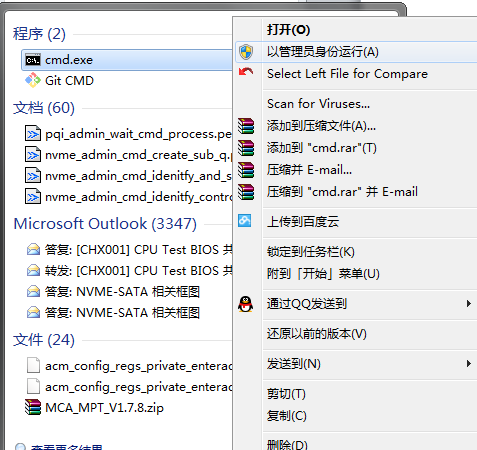

(2)配置BCD,在cmd中输入如下命令:

```shell
bcdedit /set {bootmgr} bootdebug on
bcdedit /set {bootmgr} debugtype serial
bcdedit /set {bootmgr} debugport 1
bcdedit /set {bootmgr} baudrate 115200
```

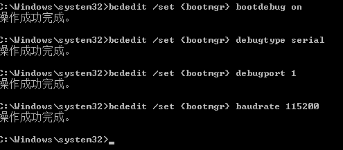

注: 1.debugport x, x为实际目标机用的com口.

2.如果要调试 winload,将{bootmgr}改为{current}即可.

(3)设置调试模式

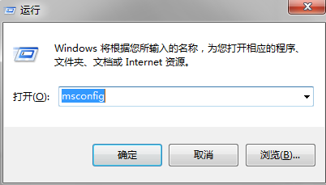

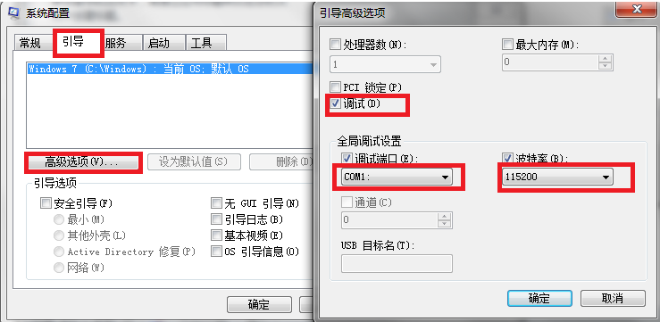

COM口根据实际情况设置。


2.3 设置Host机器
------------

### 2.3.1 安装windbg

首先根据自己的操作系统至MSDN官网下载对应的Windbg，现在Windbg和WDK（Windows
Driver Kit）集成在一起，下载路径为：

https://developer.microsoft.com/en-us/windows/hardware/windows-driver-kit

### 2.3.2 配置Windbg

#### 2.3.2.1 下载symbol文件

根据第一章的路径，下载symbol 文件保存在本地。

#### 2.3.2.2 设置symbol路径

选择File-\>Symbol File Path，打开路径设置，如下对话框。

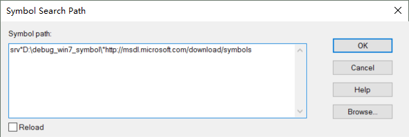

srv\*D:\\debug\_win7\_symbol\\\*http://msdl.microsoft.com/download/symbols

其中红色部分为你保存symbol的路径

#### 2.3.2.3 设置调试方式

打开 File -\> Kernel Debug ，出现如下对话框设置好连接方式的属性。

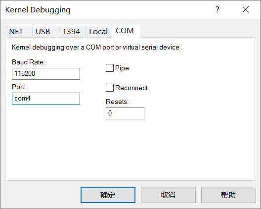

这里的com口根据自己的实际连接方式来设置。设置好了以后点击确定即可。


3 联机调试
========


3.1 测试是否正常
------------

首先将target
机器设置为调试模式。Windbg菜单栏上如下图所示证明Target机器已经进入调试模式了。

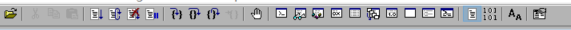

如果是下面这中模式则需要点击红框中的图标，使target机处于调试模式。


在命令行中输入!amli debugger，如果没有反应则证明已经搭建好环境了。如下图所示:

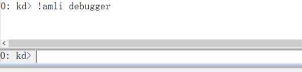


4 Windbg 命令
===========


4.1 察看模块信息
--------------

lm显示所有模块信息

lmf 显示所有模块及其路径

lmD 显示所有模块详细信息

!lmi  [module name] 显示某一模块的详细信息


5 调试ACPI常用命令
================


5.1 !amli dns
---------

!amli dns 查看所有的ACPI路径


5.2 !amli dns /s 
-------------

查看某一个根路径下的ASL，例如

!amli dns /s /\_sb.pci0.sbrg.ec


6 追踪S3代码
==========

1.  首先，根据上面描述的配置好环境；然后在命令行中依次执行以下代码

2.  .reload（重新加载路径）
3.  !amli debugger（打开debugger）
4.  !amli set verboseon (设置全局调试)
5.  !amli set traceon
6.  !amli set spewon
7.  g (断开host 和target )

具体操作流程如下图所示


最后让目标机进入所需要的状态

1.  在target机器上使电脑进入s3

2.  g (运行，这是可以在windbg上看到acpi的代码)


7 关于windbg不显示输出信息
========================


7.1 问题描述
--------

在追踪S3代码的时候需要安装显卡驱动，但是我遇到了装完显卡驱动后，windbg不输出信息，原因可能是在装驱动时禁止了OS的ACPI输出。


7.2 解决办法
--------

在第一章所需资料中打开路径中的\\tool\\setdbgfilter
选择自己OS所对应的程序，在target机器上运行，设置DEFAULT/ACPI 设置为0x8 或0xf(在Tool中为10进制即为15

Update 一下，重启即可。


8 Win10 设置
==========


8.1 Win10 文件路径
--------------

服务器地址

[\\\\zxshfs01\\CPU-SW\\Technology\\BIOS\\ACPI\\acpi 调试环境搭建\\win
10](file:///\\zxshfs01\CPU-SW\Technology\BIOS\ACPI\acpi%20调试环境搭建\win%2010)


8.2 Win10 target机设置
------------------

Win10 设置顺序为

1.  将windows10为debug模式，设置方式，以管理员身份进入cmd，输入

>   bcdedit /set {default} DEBUG YES

>   bcdedit /set TESTSIGNING ON

如下图所示

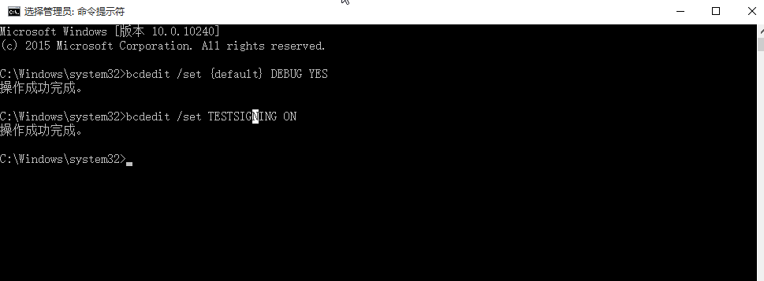

2. 设置win10 调试模式，运行msconfig，如下图设置


3. 打开开发人员选项

>   设置----更新和安全-----针对开发人员-----开发人员模式

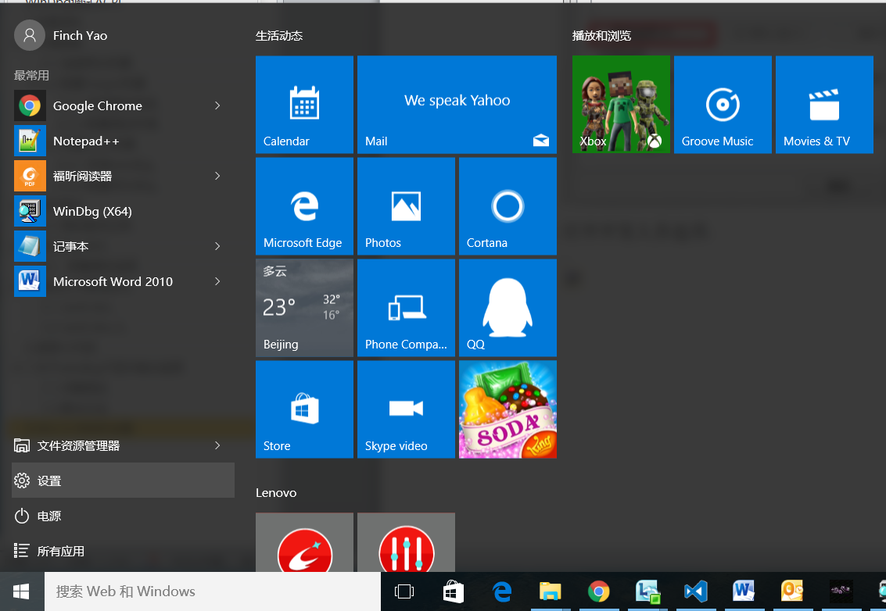

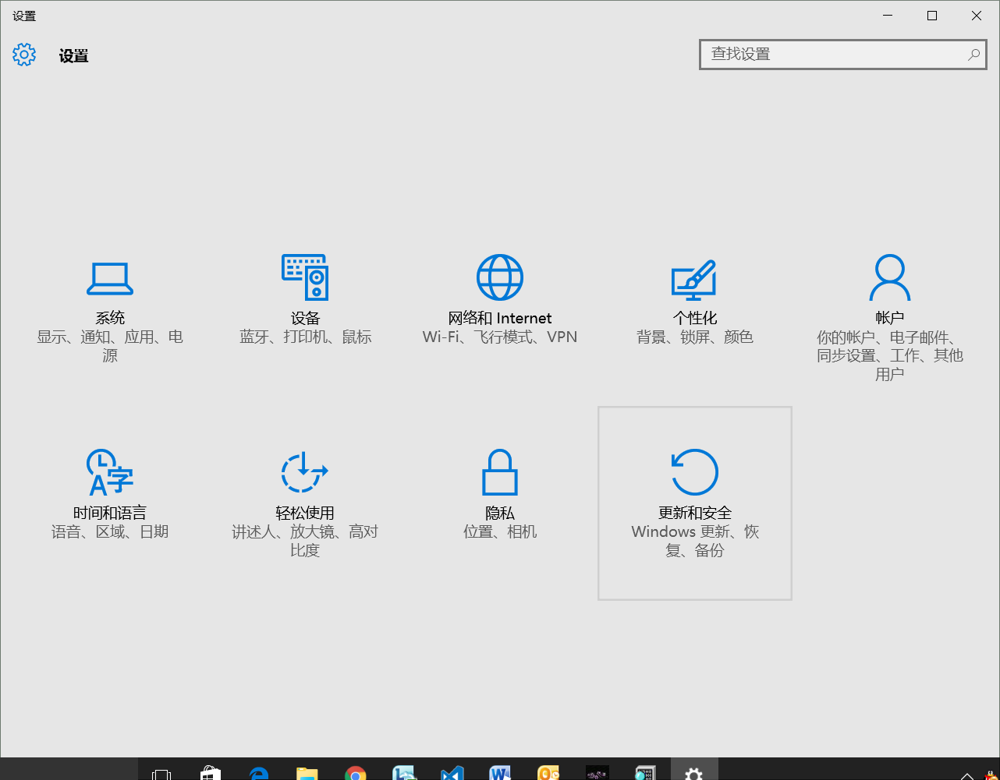

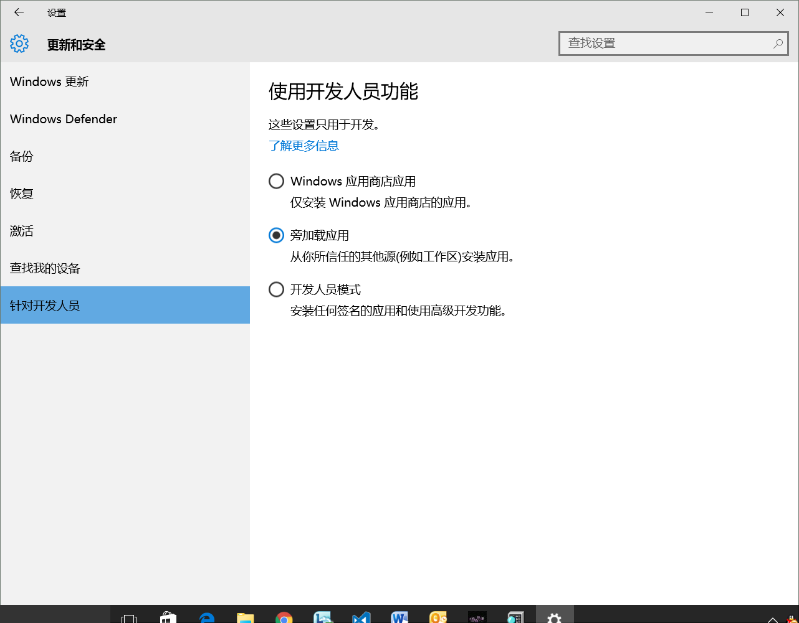


8.3 Host机设置
----------

大部分设置是和win7 是一致的，只是win10的symbol文件需要重新配置，根据第一节的路径解压其中的symbol
文件至本地Symbol文件配置，配置方法见上面

srv\* D:\\Symbols\\\*http://msdl.microsoft.com/download/symbols

其中红色部分为你保存symbol的路径,也可以在msdn上下载，可以根据自己系统下载，下载路径是

https://developer.microsoft.com/en-us/windows/hardware/download-symbols
